<h1 align="center">Segmented Market Basket Analysis on Superstore</h1>
<p align="center">
  <em>Mining association rules globally, then again inside behavioural customer segments, to show what a store-wide analysis averages away.</em>
</p>
<p align="center">
  
  
  
  
  
  
  
</p>

---

## Introduction

Market basket analysis usually treats a customer base as one population. This project tests whether that assumption holds.

The pipeline runs in three stages, and each one decides the next:

1. **Mine association rules across all customers** using Apriori, FP-Growth and ECLAT. All three return **identical rules** — only runtime differs — so the algorithm choice downstream is free.
2. **Segment customers** with DBSCAN and KMeans. DBSCAN collapses 775 of 793 customers into one cluster plus a noise bucket, so **KMeans** supplies the labels.
3. **Re-mine rules inside each segment** at identical thresholds.

The result is lopsided in a way the global analysis completely hides: the **high-value segment holds 7% of customers but produces 149 rules with a maximum lift of 19.97**, while the unprofitable segment yields 6 weak rules. Cross-sell signal is not distributed evenly, and mining the store as a single population buries that.

---

## 1. Dataset

The [Superstore Dataset](https://www.kaggle.com/datasets/vivek468/superstore-dataset-final) from Kaggle — four years of US retail orders at line-item granularity.

| Field | Description |
| :--- | :--- |
| `Order ID` | Transaction identifier, groups the basket |
| `Customer ID` | Customer identifier, 793 unique |
| `Category` / `Sub-Category` | 3 categories, 17 sub-categories |
| `Product Name` | ~1,850 distinct products |
| `Sales`, `Quantity`, `Discount`, `Profit` | Numeric measures, no missing values |

| Stage | Rows |
| :--- | ---: |
| Raw order lines | 9,994 |
| After duplicate removal | **9,978** |
| Removed | 16 (0.16 %) |

The removed rows are cases where one Product ID appears twice in the same Order ID with different quantities. Since neither copy is identifiably correct, both are dropped rather than guessed at.

<p align="center">
  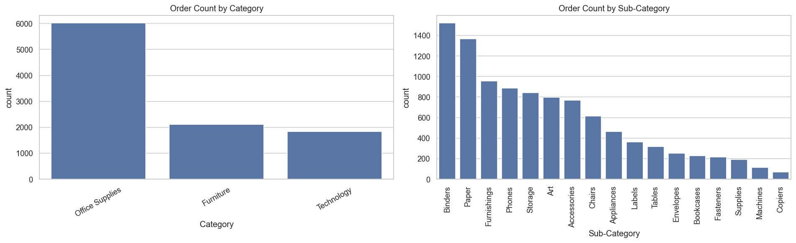
</p>
<p align="center"><em>Figure 1. Order counts across categories and sub-categories.</em></p>

The item space is heavily skewed: Binders (1,521 lines) and Paper (1,366) dominate, while Copiers (68) and Machines (115) barely register. This matters later — an item appearing in a third of all baskets will surface as a consequent in almost every rule, which is a property of the catalogue rather than a shopping insight, and the reason lift is read in preference to confidence throughout.

**Sub-Category is used as the item.** At product level, ~1,850 items across ~5,000 transactions push support so low that nothing survives a sensible threshold. Sub-Category keeps the item space at 17 and the rules readable.

---

## 2. Association Rule Mining

A transaction is the set of unique Sub-Categories in one `Order ID`, giving **5,007 transactions over 17 items**. This stage runs on **all customers, with no segmentation** — it is the baseline that Section 5 is compared against.

$$
\text{support}(X) = \frac{|\{t : X \subseteq t\}|}{|T|}
\qquad
\text{confidence}(X \Rightarrow Y) = \frac{\text{support}(X \cup Y)}{\text{support}(X)}
\qquad
\text{lift}(X \Rightarrow Y) = \frac{\text{confidence}(X \Rightarrow Y)}{\text{support}(Y)}
$$

Thresholds: `min_support = 0.001`, `min_confidence = 0.7`. Lift is the metric that matters here because it divides out the baseline popularity that Figure 1 exposes.

### 2.1 Three algorithms, one answer

ECLAT is not in `mlxtend`, so it is implemented from scratch using the **vertical tidset** representation: each item maps to the set of transaction IDs containing it, support is the size of a tidset intersection, and candidates grow depth-first without ever rescanning the database.

<p align="center">
  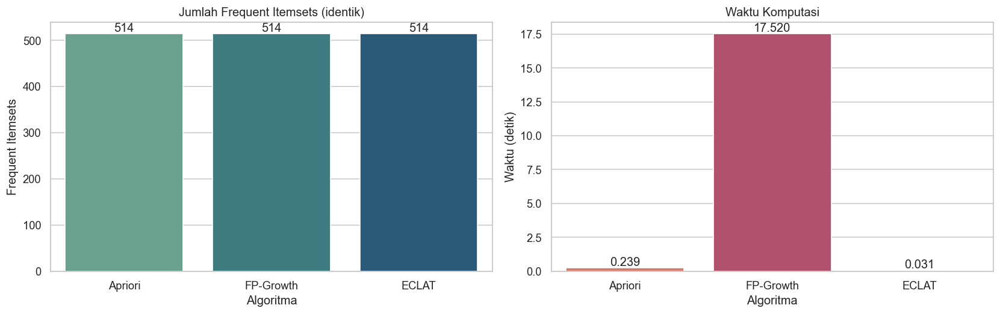
</p>
<p align="center"><em>Figure 2. Frequent itemset counts and runtime for the three algorithms.</em></p>

| Algorithm | Frequent itemsets | Rules | Time |
| :--- | ---: | ---: | ---: |
| Apriori | 514 | 11 | **0.045 s** |
| FP-Growth | 514 | 11 | 4.479 s |
| ECLAT *(from scratch)* | 514 | 11 | **0.022 s** |

A direct DataFrame equality check confirms all three rule sets are **identical**. They should be — these algorithms differ in *how they search*, not in what qualifies as frequent. Confirming it explicitly has a practical payoff: since the output is the same either way, the choice for the segmented stage becomes a pure performance decision.

The runtime gap is worth explaining rather than reading as a ranking. FP-Growth taking 100× longer than Apriori looks wrong until you notice `min_support = 0.001`: at a threshold that low, `mlxtend` builds an FP-tree holding nearly the entire dataset, while Apriori's candidate pruning stays cheap when there are only 17 items to combine. That is a property of these parameters and this implementation, not evidence that FP-Growth is a weaker algorithm — on a wide item space at a normal threshold the ordering would likely flip.

### 2.2 What the rules say

Eleven rules cleared the thresholds, listed here in full and ranked by lift.

| # | Antecedent | → | Consequent | Orders | Support | Confidence | Lift |
| ---: | :--- | :---: | :--- | ---: | ---: | ---: | ---: |
| 1 | Appliances, Furnishings, Tables | → | Phones | 7 | 0.0014 | 70.0 % | **4.31** |
| 2 | Appliances, Phones, Tables | → | Furnishings | 7 | 0.0014 | 70.0 % | **4.00** |
| 3 | Chairs, Copiers | → | Paper | 8 | 0.0016 | **80.0 %** | 3.37 |
| 4 | Accessories, Furnishings, Tables | → | Paper | 7 | 0.0014 | 77.8 % | 3.28 |
| 5 | Accessories, Appliances, Chairs | → | Binders | 6 | 0.0012 | 75.0 % | 2.86 |
| 6 | Accessories, Appliances, Furnishings | → | Binders | 9 | 0.0018 | 75.0 % | 2.86 |
| 7 | Art, Fasteners, Phones | → | Binders | 6 | 0.0012 | 75.0 % | 2.86 |
| 8 | Appliances, Chairs, Furnishings | → | Binders | 8 | 0.0016 | 72.7 % | 2.77 |
| 9 | Appliances, Furnishings, Storage | → | Binders | 12 | 0.0024 | 70.6 % | 2.69 |
| 10 | Fasteners, Phones, Storage | → | Binders | 7 | 0.0014 | 70.0 % | 2.67 |
| 11 | Fasteners, Tables | → | Binders | 7 | 0.0014 | 70.0 % | 2.67 |

The **Orders** column converts support into raw basket counts, and it is the most sobering column in the table — the entire global rule set rests on 6 to 12 orders per rule.

<p align="center">
  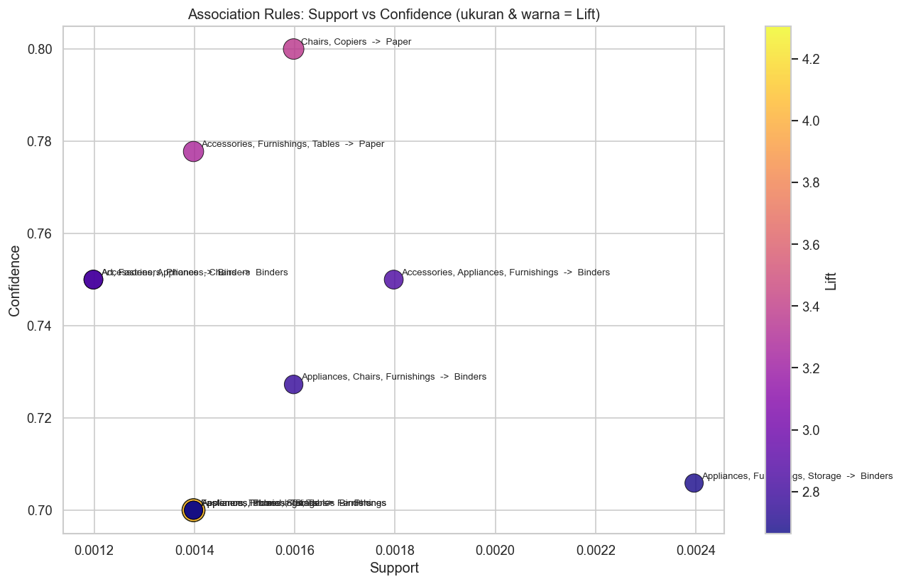
</p>
<p align="center"><em>Figure 3. Support against confidence, with point size and colour encoding lift.</em></p>

Every rule sits in the far-left strip of the support axis. High confidence, very low support: real patterns, but thin ones, better treated as hypotheses to test than conclusions to act on.

<p align="center">
  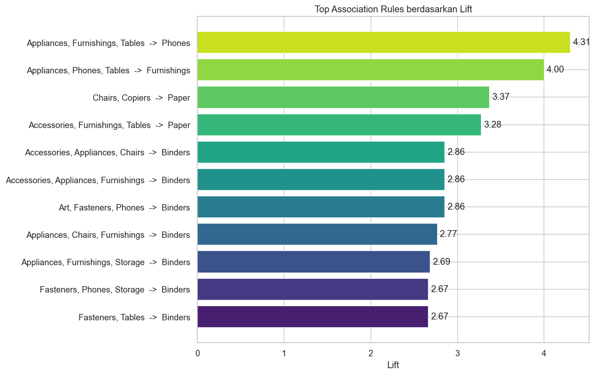
</p>
<p align="center"><em>Figure 4. Association rules ranked by lift.</em></p>

The strongest associations are `Appliances, Furnishings, Tables → Phones` (lift 4.31) and `Appliances, Phones, Tables → Furnishings` (lift 4.00). By confidence, `Chairs, Copiers → Paper` leads at 80% with a lift of 3.37 — someone furnishing an office with seating and a copier very likely adds paper to the same order, which passes the common-sense check that a purely statistical rule cannot.

<p align="center">
  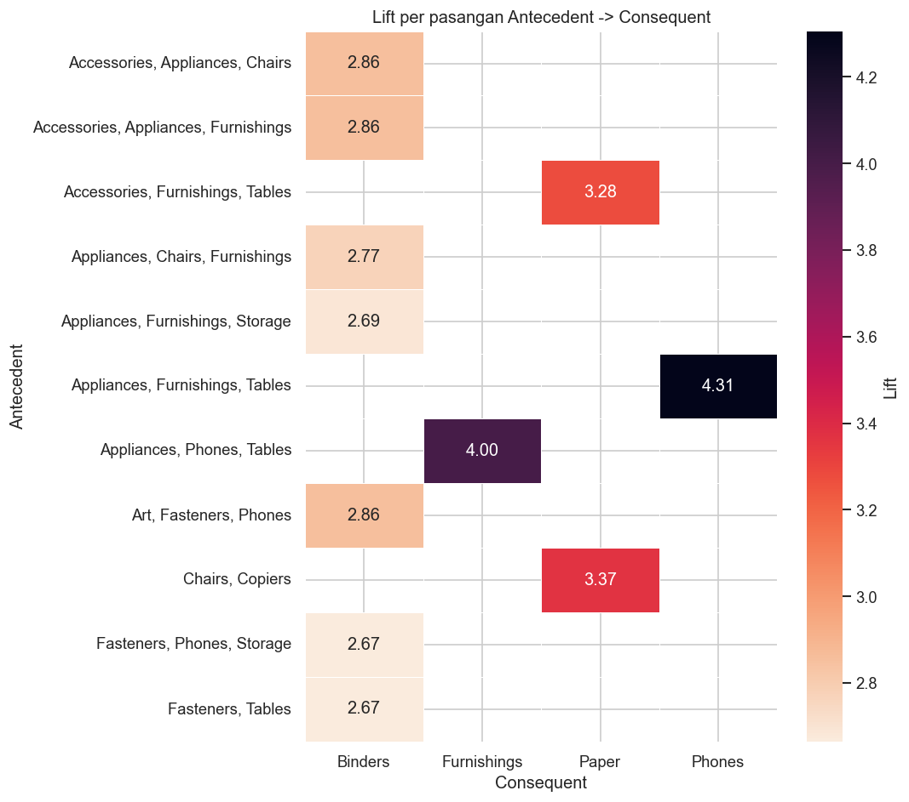
</p>
<p align="center"><em>Figure 5. Lift for each antecedent → consequent pair.</em></p>

The consequent concentration is unmistakable: Binders sits on the right-hand side of 7 of the 11 rules, Paper in 2. This is the catalogue skew from Figure 1 resurfacing, and it is exactly why lift is the metric of record — lift already corrects for how common the consequent is on its own.

<p align="center">
  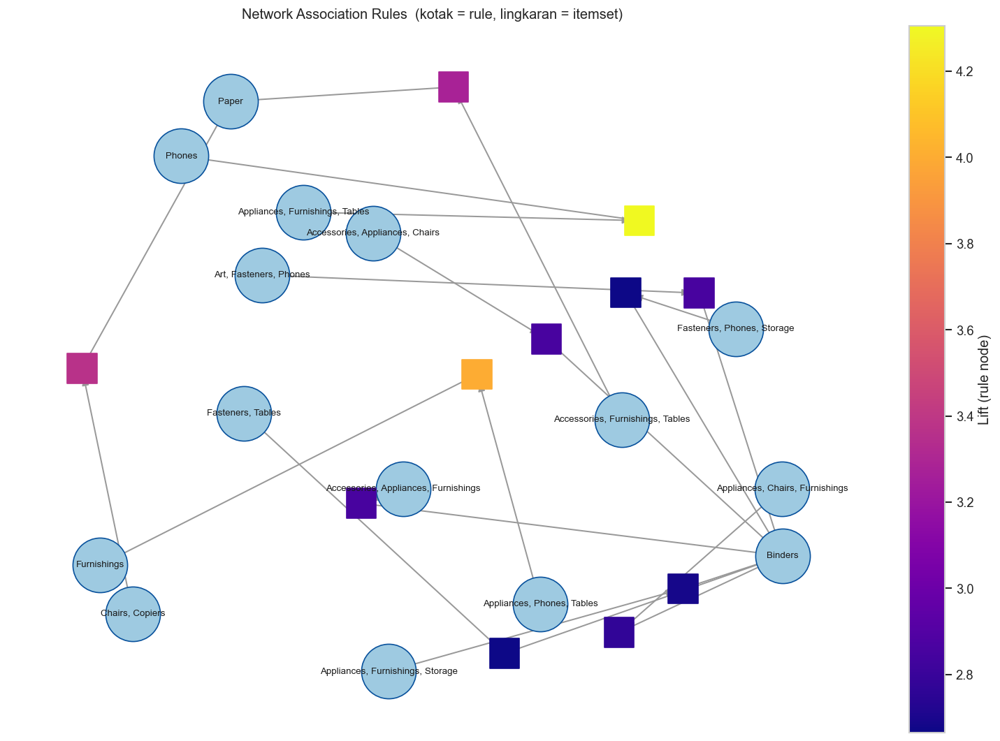
</p>
<p align="center"><em>Figure 6. Rules as a bipartite graph — circles are itemsets, squares are rules coloured by lift.</em></p>

The network view exposes structure the table hides. Paper and Binders act as hubs that many separate antecedent groups feed into, while the rest of the catalogue connects only sparsely. The store has two connective products and a lot of loosely attached periphery.

---

## 3. Customer Segmentation

Transaction lines are aggregated to one row per `Customer ID` — total Sales, total Quantity, mean Discount, order count, total Profit — giving **793 customers**. All five features are standardised first, since Sales runs into the tens of thousands while Discount sits between 0 and 0.8.

### 3.1 DBSCAN, and why it was rejected

<p align="center">
  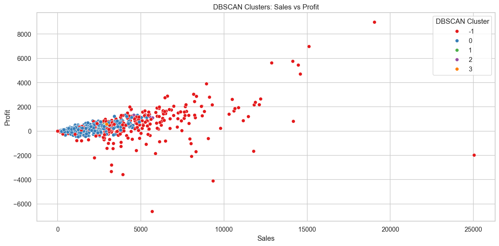
</p>
<p align="center"><em>Figure 7. DBSCAN result at eps=0.5, min_samples=5.</em></p>

| DBSCAN label | Customers |
| :--- | ---: |
| 0 (main cluster) | 494 |
| −1 (noise) | 281 |
| 1 / 2 / 3 | 6 each |

**775 of 793 customers land in just two buckets** — one giant cluster and one noise pile — with three clusters of six people hanging off the side. That is unusable as a segmentation: rules cannot be mined for a "segment" that is either everybody or an unlabelled leftover, and the high spenders that matter most get swept into noise rather than separated out.

The cause is a shape mismatch. Customer spending is a continuum with a long tail, not a set of dense islands separated by empty space, so a density-based method has no valleys to cut along. The negative result is kept because it justifies the next choice.

### 3.2 KMeans

<p align="center">
  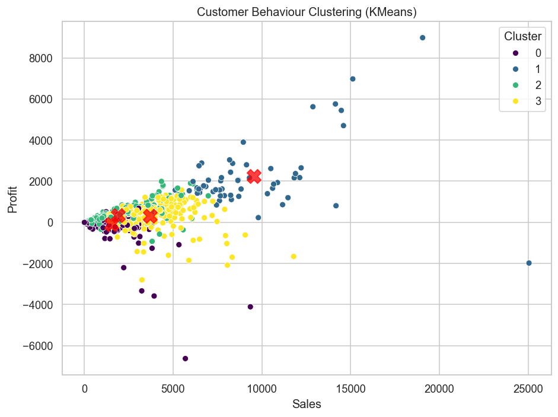
</p>
<p align="center"><em>Figure 8. Four KMeans segments, with centroids marked.</em></p>

Silhouette score at `k=4` is **0.2725** — modest, and worth stating plainly: these are cuts through a continuum, not naturally separated islands. But the cluster *profiles* are stable and business-readable, which is what the next stage needs.

| Segment | Customers | Avg Sales | Orders/cust | Avg Discount | Avg Profit |
| :--- | ---: | ---: | ---: | ---: | ---: |
| S0 — Low-value *(unprofitable)* | 186 | 1,544 | 8.3 | **0.26** | **−99** |
| S1 — Mid-value | 308 | 1,883 | 9.2 | 0.10 | 340 |
| S2 — Upper-mid | 244 | 3,686 | 18.5 | 0.17 | 311 |
| S3 — High-value | 55 | 9,553 | 19.7 | 0.12 | **2,238** |

S0 is the row to read twice. Those 186 customers lose money on average, and the explanation sits in the same row: a mean discount of 26%, more than double any other segment. Meanwhile S3 — 7% of the base — spends five times more per head on a *smaller* discount than the group bleeding money.

---

## 4. Segmented Rule Mining

Every transaction is tagged with its customer's KMeans segment, and rules are mined separately inside each one. Two choices carry over from the earlier sections, and both were made because of what those sections found:

- **KMeans supplies the segments** — DBSCAN produced nothing minable (Section 3.1).
- **The algorithm choice is free, so speed decides it** — Section 2.1 proved the three miners agree, and this stage runs the miner four times instead of once. The notebook's `mine_rules()` helper uses FP-Growth; at `min_support = 0.005` on segments of a few hundred to a couple of thousand orders, the FP-tree overhead that made it slow in Section 2.1 disappears, and substituting Apriori or the custom ECLAT would return the same rules.

All four segments use **identical thresholds** (support ≥ 0.005, confidence ≥ 0.4, lift ≥ 1), so rule counts compare directly instead of reflecting per-segment tuning.

<p align="center">
  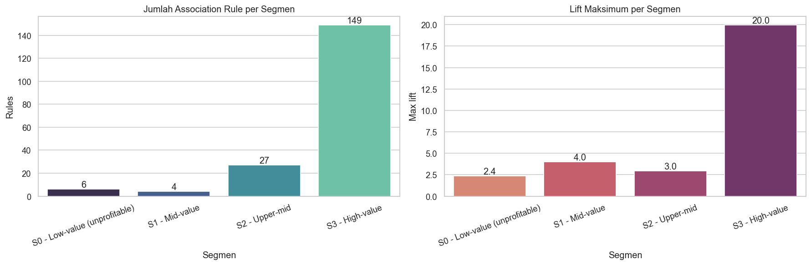
</p>
<p align="center"><em>Figure 9. Number of rules and maximum lift, per segment.</em></p>

| Segment | Customers | Orders | Rules | Max lift | Mean lift | Top rule |
| :--- | ---: | ---: | ---: | ---: | ---: | :--- |
| S0 — Low-value | 186 | 893 | 6 | 2.38 | 1.69 | `Bookcases, Paper → Binders` |
| S1 — Mid-value | 308 | 1,609 | 4 | 4.02 | 2.94 | `Binders, Fasteners → Storage` |
| S2 — Upper-mid | 244 | 2,039 | 27 | 2.95 | 1.78 | `Binders, Furnishings, Phones → Storage` |
| **S3 — High-value** | **55** | **466** | **149** | **19.97** | **3.22** | `Binders, Phones, Storage → Appliances, Paper` |

**S3 has the fewest customers and the fewest orders, yet produces 149 rules — more than five times the other three segments combined.** High-value customers buy across the catalogue in consistent, repeatable combinations; their baskets have structure. At the other end, S0's six rules average a lift of 1.69, barely above independence.

<p align="center">
  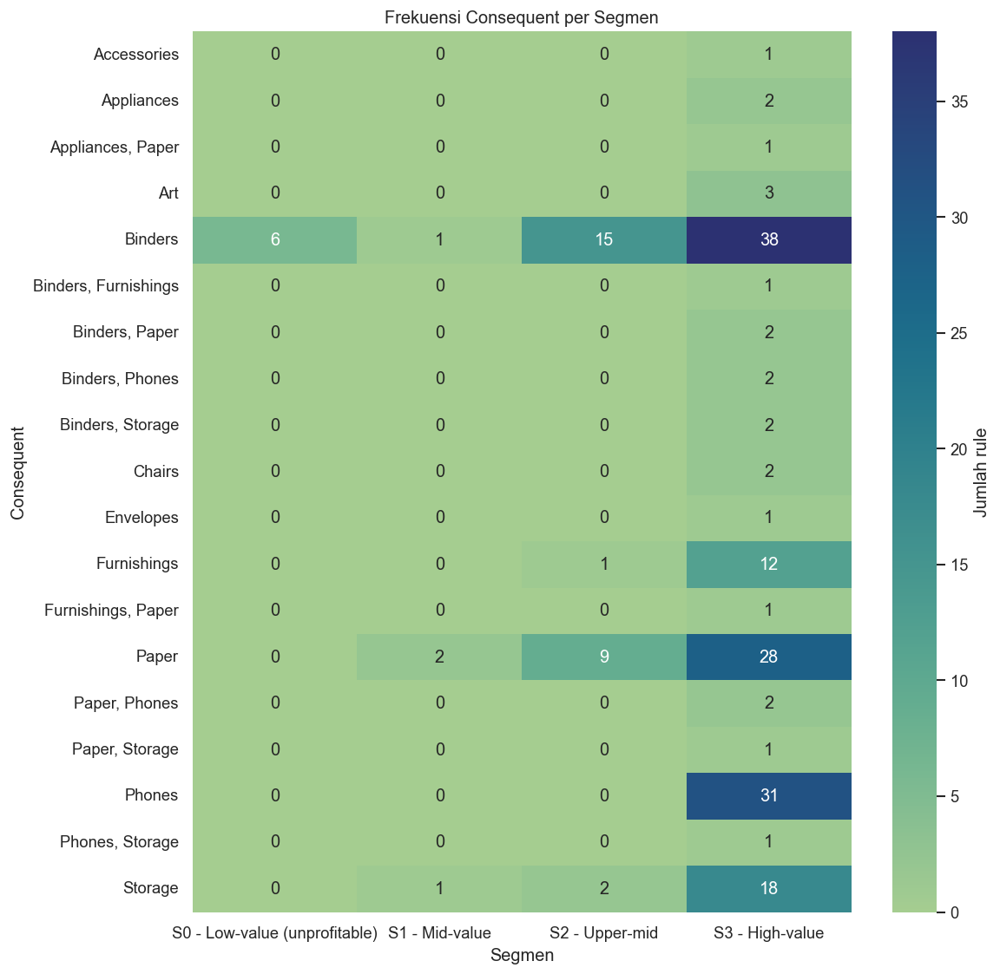
</p>
<p align="center"><em>Figure 10. How often each item appears as a consequent, by segment.</em></p>

Paper and Binders stay dominant consequents in every segment, so their role as connective products is genuinely general rather than an artefact of one customer type.

<p align="center">
  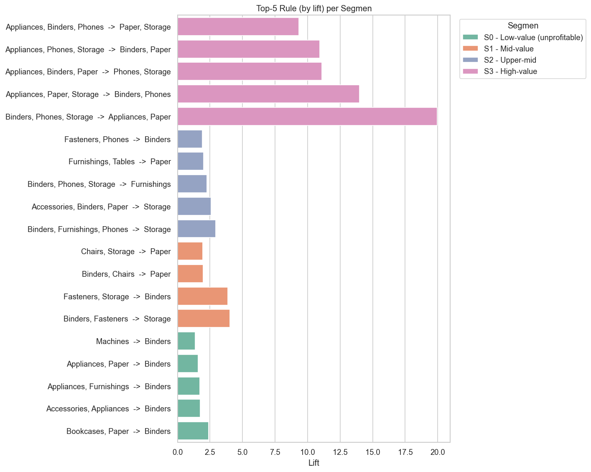
</p>
<p align="center"><em>Figure 11. Strongest five rules by lift, for each segment.</em></p>

Side by side, the segments are not merely producing *more* rules — they produce *different* ones. S1's strongest pattern is `Fasteners ↔ Storage`, which appears nowhere in the global rule set at all. It was averaged out of existence by the other three segments, which is the clearest single piece of evidence for the whole approach.

### 4.1 The rules themselves

<details>
<summary><b>S0 — Low-value, unprofitable</b> · 186 customers · 893 orders · <b>6 rules</b></summary>

| # | Antecedent | → | Consequent | Orders | Support | Confidence | Lift |
| ---: | :--- | :---: | :--- | ---: | ---: | ---: | ---: |
| 1 | Bookcases, Paper | → | Binders | 6 | 0.0067 | 75.0 % | 2.38 |
| 2 | Accessories, Appliances | → | Binders | 5 | 0.0056 | 55.6 % | 1.76 |
| 3 | Appliances, Furnishings | → | Binders | 6 | 0.0067 | 54.5 % | 1.73 |
| 4 | Appliances, Paper | → | Binders | 6 | 0.0067 | 50.0 % | 1.58 |
| 5 | Machines | → | Binders | 6 | 0.0067 | 42.9 % | 1.36 |
| 6 | Phones, Storage | → | Binders | 5 | 0.0056 | 41.7 % | 1.32 |

Every rule points to the same consequent, and the mean lift of 1.69 is barely above independence. This segment has no cross-sell structure worth acting on.

</details>

<details>
<summary><b>S1 — Mid-value</b> · 308 customers · 1,609 orders · <b>4 rules</b></summary>

| # | Antecedent | → | Consequent | Orders | Support | Confidence | Lift |
| ---: | :--- | :---: | :--- | ---: | ---: | ---: | ---: |
| 1 | Binders, Fasteners | → | Storage | 9 | 0.0056 | 56.3 % | **4.02** |
| 2 | Fasteners, Storage | → | Binders | 9 | 0.0056 | 75.0 % | 3.86 |
| 3 | Binders, Chairs | → | Paper | 13 | 0.0081 | 48.1 % | 1.97 |
| 4 | Chairs, Storage | → | Paper | 9 | 0.0056 | 47.4 % | 1.93 |

The `Fasteners ↔ Storage` pair is bidirectional and strong in both directions, and it is absent from the global rule set entirely.

</details>

<details>
<summary><b>S2 — Upper-mid</b> · 244 customers · 2,039 orders · <b>27 rules</b> (top 10 shown)</summary>

| # | Antecedent | → | Consequent | Orders | Support | Confidence | Lift |
| ---: | :--- | :---: | :--- | ---: | ---: | ---: | ---: |
| 1 | Binders, Furnishings, Phones | → | Storage | 12 | 0.0059 | 50.0 % | 2.95 |
| 2 | Accessories, Binders, Paper | → | Storage | 11 | 0.0054 | 44.0 % | 2.59 |
| 3 | Binders, Phones, Storage | → | Furnishings | 12 | 0.0059 | 41.4 % | 2.27 |
| 4 | Furnishings, Tables | → | Paper | 12 | 0.0059 | 52.2 % | 2.00 |
| 5 | Fasteners, Phones | → | Binders | 11 | 0.0054 | 55.0 % | 1.92 |
| 6 | Appliances, Furnishings | → | Binders | 21 | 0.0103 | 52.5 % | 1.84 |
| 7 | Accessories, Paper, Storage | → | Binders | 11 | 0.0054 | 52.4 % | 1.83 |
| 8 | Fasteners, Furnishings | → | Binders | 12 | 0.0059 | 52.2 % | 1.82 |
| 9 | Furnishings, Phones, Storage | → | Binders | 12 | 0.0059 | 52.2 % | 1.82 |
| 10 | Appliances, Storage | → | Binders | 15 | 0.0074 | 50.0 % | 1.75 |

Storage joins Paper and Binders as a recurring consequent here, which does not happen in any other segment.

</details>

<details>
<summary><b>S3 — High-value</b> · 55 customers · 466 orders · <b>149 rules</b> (top 10 shown)</summary>

| # | Antecedent | → | Consequent | Orders | Support | Confidence | Lift |
| ---: | :--- | :---: | :--- | ---: | ---: | ---: | ---: |
| 1 | Binders, Phones, Storage | → | Appliances, Paper | 3 | 0.0064 | 42.9 % | **19.97** |
| 2 | Appliances, Paper, Storage | → | Binders, Phones | 3 | 0.0064 | 75.0 % | 13.98 |
| 3 | Appliances, Binders, Paper | → | Phones, Storage | 3 | 0.0064 | 50.0 % | 11.10 |
| 4 | Appliances, Phones, Storage | → | Binders, Paper | 3 | 0.0064 | 75.0 % | 10.92 |
| 5 | Appliances, Binders, Phones | → | Paper, Storage | 3 | 0.0064 | 50.0 % | 9.32 |
| 6 | Envelopes, Storage | → | Paper, Phones | 4 | 0.0086 | 66.7 % | 9.14 |
| 7 | Binders, Fasteners | → | Furnishings, Paper | 3 | 0.0064 | 42.9 % | 9.08 |
| 8 | Fasteners, Furnishings | → | Binders, Paper | 3 | 0.0064 | 60.0 % | 8.74 |
| 9 | Appliances, Paper, Phones | → | Binders, Storage | 3 | 0.0064 | 60.0 % | 8.47 |
| 10 | Fasteners, Paper | → | Binders, Furnishings | 3 | 0.0064 | 42.9 % | 7.99 |

Two things separate this segment from the rest. The consequents are **multi-item** — these customers add pairs of products together, not one — and the top five rules are permutations of the same `{Appliances, Binders, Paper, Phones, Storage}` itemset, meaning the model has found one large recurring basket rather than five independent patterns.

The Orders column is also the caveat: at `min_support = 0.005` on 466 orders, a rule needs only 3 baskets. The lift of 19.97 is arithmetically correct but built on a small denominator.

</details>

---

## 5. Key Findings

1. **Apriori, FP-Growth and ECLAT return identical rules**, verified by equality check — so choosing between them is a performance decision, never an accuracy one.
2. **Runtime reflects parameters, not algorithm quality.** FP-Growth's 4.5 s is an artefact of `min_support = 0.001` inflating the FP-tree, not a defect of the method.
3. **DBSCAN cannot segment this data** — 775 of 793 customers fall into one cluster plus noise, because spending is a continuum without density gaps.
4. **KMeans at k=4 scores a modest silhouette of 0.27** but yields four segments of workable size and clear business meaning.
5. **Segment-level mining surfaces what global mining averages away.** Same data, same algorithm, same thresholds — a different unit of analysis, and materially different answers.
6. **Cross-sell signal concentrates in 7% of customers.** S3 produces 149 rules against 6, 4 and 27 for the others.
7. **The unprofitable segment has a pricing problem, not a bundling problem.** Its 26% average discount explains the negative margin; its rules are too weak to build recommendations on.
8. **Paper and Binders are the store's connective tissue**, dominant as consequents both globally and within every segment.

---

## 6. Limitations

**Very low support on the global rules.** All eleven rest on 6 to 12 orders each, as the Orders column in Section 2.2 makes explicit. They are directional, not decisive.

**S3's rules rest on 466 transactions.** At `min_support = 0.005` that is 3 orders per rule, so the extreme lift values partly reflect a small denominator. The *direction* of the finding is solid; the individual top rules need more data before anyone builds a bundle around them.

**S3's top rules are not independent.** The five strongest are permutations of a single itemset, so 149 rules represent considerably fewer than 149 distinct patterns.

**Silhouette 0.27.** The segment boundaries are cuts through a continuum, so customers near a boundary could reasonably belong to either side, and their transactions carry that ambiguity into the rule mining.

**Single seed.** Everything comes from one run at `random_state=7`. Repeating across seeds would show how much of the segment structure is stable and how much is initialisation variance.

**No temporal validation.** Rules are mined over the full four-year window, so seasonality and trend are invisible, and a rule that held only in 2015 is indistinguishable from one that holds throughout.

**Mismatched thresholds between stages.** Section 2 uses `min_support = 0.001` and Section 4 uses `0.005`, so global and segmented rule counts are not directly comparable — only the segments are comparable to each other.

---

## 7. Roadmap

| Priority | Item |
| :--- | :--- |
| High | Re-mine the global rules at `min_support = 0.005` so Section 2 and Section 4 are directly comparable |
| High | Validate S3's rules on a holdout of its orders, since the top lifts rest on very few baskets |
| High | Repeat clustering across several seeds and report segment stability |
| Medium | Swap raw totals for RFM features in the clustering and compare silhouette |
| Medium | Test `k` from 2 to 10 with elbow and silhouette curves rather than fixing `k=4` |
| Medium | Benchmark the three miners at product level, where the item space is wide enough for the runtime comparison to mean something |
| Low | Add temporal splits to test whether segment rules hold quarter to quarter |
| Low | Measure whether segment rules beat global rules at predicting held-out basket contents |

Re-mining both stages at a shared threshold is the highest-value fix, because it is the one change that would let the central claim — segments reveal what the global view hides — be stated as a direct numerical comparison rather than an inference across two parameter settings.

---

## 8. Quick Start

```bash
pip install pandas numpy scikit-learn mlxtend networkx matplotlib seaborn
jupyter notebook Model.ipynb
```

```python
from mlxtend.frequent_patterns import fpgrowth, association_rules
from mlxtend.preprocessing import TransactionEncoder

def mine_rules(frame, min_support=0.005, min_confidence=0.4, min_lift=1.0):
    tx = frame.groupby('Order ID')['Sub-Category'].apply(lambda x: list(set(x))).tolist()
    te = TransactionEncoder()
    enc = pd.DataFrame(te.fit(tx).transform(tx), columns=te.columns_)
    itemsets = fpgrowth(enc, min_support=min_support, use_colnames=True)
    rules = association_rules(itemsets, metric='confidence', min_threshold=min_confidence)
    return rules[rules['lift'] >= min_lift].sort_values('lift', ascending=False)

for seg in sorted(df['Segment'].dropna().unique()):
    print(seg, len(mine_rules(df[df['Segment'] == seg])))
```

`Superstore.csv` must be read with `encoding="latin1"` — plain UTF-8 fails on several product names. Run the notebook in cell order; the KMeans cell in Section 5 must execute before the segmented mining in Section 8, which depends on its labels.

**Stack:** Python, pandas, NumPy, scikit-learn, mlxtend, NetworkX, Matplotlib, Seaborn

---

## 9. Project Structure

```text
Superstore-Data-Mining/
│
├── data/
│   └── Superstore.csv                   # Kaggle dataset
│
├── notebooks/
│   ├── EDA.ipynb                        # Full exploratory analysis
│   └── Model.ipynb                      # Clustering, rule mining, segmented mining
│
├── Result/
│   ├── category_distribution.png
│   ├── algorithm_comparison.png         # Apriori vs FP-Growth vs ECLAT
│   ├── support_confidence.png
│   ├── top_rules_lift.png
│   ├── lift_heatmap.png
│   ├── rule_network.png
│   ├── dbscan_clusters.png
│   ├── kmeans_clusters.png
│   ├── segment_comparison.png
│   ├── consequent_heatmap.png
│   └── top_rules_per_segment.png
│
├── requirements.txt
└── README.md
```

---

<p align="center">
  <sub>Built by <a href="https://github.com/HaikalSyafie">Haikal Syafie</a></sub>
</p>